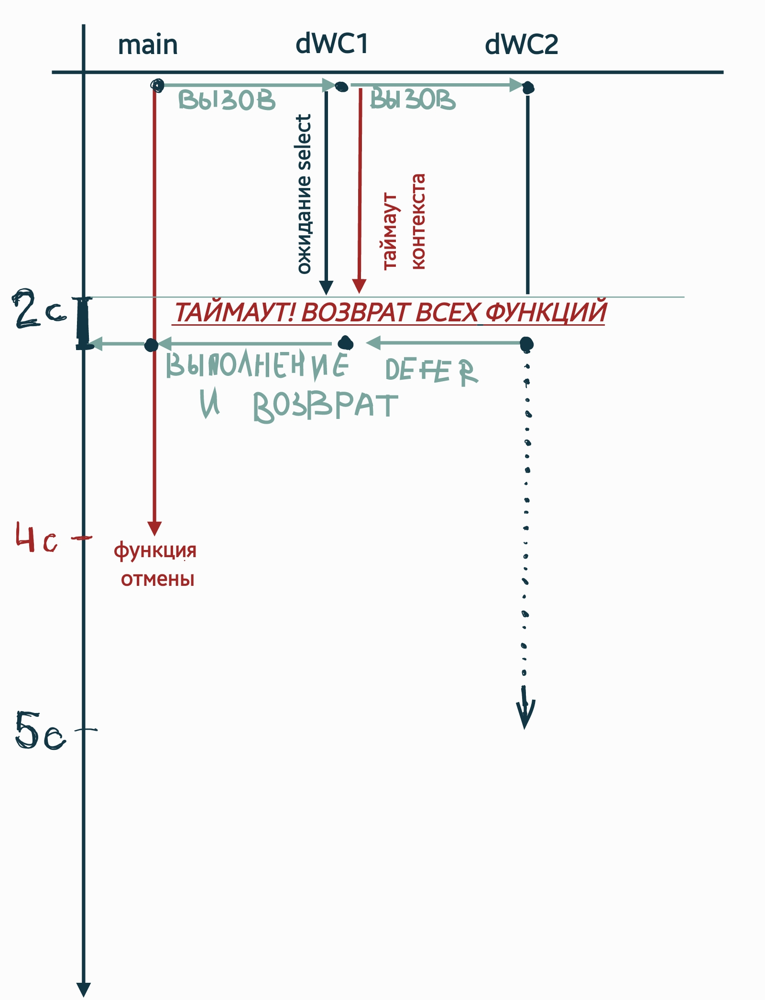

## Возможности контекста в языке Go
Этот проект посвящён исследованию стандартной библиотеки `context` 
и возможностей для её применения.
Контекст обычно создаётся в какой-то родительской функции и передаётся в 
дочернюю. Он имеет смысл при параллельном выполнении. Например, когда 
дочерняя функция - отдельная горутина или вообще отдельный сервис, к которому
посылается запрос.

### Про использование
Во многих API Go, особенно современных, первым аргументом функций
и методов часто является `Context`. Контекст предоставляет
средства передачи крайних сроков, отмены вызывающего абонента и
других значений области запроса через границы API и между процессами.

Контекст часто передаётся в функцию первым параметром, но в некоторых
старых библиотеках для обратной совместимости был включен в передаваемую
структуру (например, в методе `Do` библиотеки `http/net`)

В контексте несмотря на наличие словаря ключ-значение не принято
передавать какие-то параметры функции. Вместо этого его используют
для передачи данных, близких к описанию вызова (например, `id` запроса
или параметры среды) и чаще всего используют для логов.

Еще одним применением контекста является высвобождение памяти и
прочие операции которые можно выполнить в случае вызова функции отмены.

При высоких уровнях вложенности контекст должен наследоваться от
родительского с добавлением каких-то функций, иначе говоря, он должен
"плыть" при спуске.

### Создание контекстов (уровень родителя)
Контексты создаются в вызывающей функции/процессоре и бывают разные 
по функционалу. Ниже примеры их создания:
#### 1. `context.Background() Context`
Это просто пустой контекст. Он используется на самом высоком уровне
(то есть для передачи данных из `main` или в обработчике высокого уровня).

#### 2. `context.TODO() Context`
Аналогичен предыдущему, но используется как заглушка, если пока что мы не 
уверены, какой контекст использовать. Это полезно, например, при выявлении
ошибок через CI/CD.
***
При многократной вложенности обычно контекст может получать дополнительный
функционал на каждом этапе. Для этого используется наследование 
контекста, т.е. к родительскому контексту добавляются 
дополнительные свойства. Следующие функции создают копию 
родительского контекста с добавлением различных функций:

#### 3. `context.WithValue(parent Context, key, val interface{}) (Context, CancelFunc)`
По сути, создаёт производный от родительского контекст, где к родительскому
добавлена передаваемая пара ключ-значение.

#### 4. `context.WithCancel(parent Context) (Context, CancelFunc)`
Возвращает производный контекст и **функцию отмены**. Когда выполняется 
функция отмены, все функции с данным контекстом должны завершиться. 
Корректно работать с функцией отмены в той функции, где она была создана.

#### 5. `context.WithDeadline(parent Context, d time.Time) (Context, CancelFunc)`
Аналогично п.4, кроме функции отмены, позволяет установить 
дедлайн для отмены контекста. 

#### 6. `context.WithTimeout(parent Context, timeout time.Duration) (Context, CancelFunc)`
Здесь задаётся не дедлайн, а таймаут отмены. Т.е. использование `WithDeadline`
задаёт конкретное время прерывания, а `WithTimeout` - время с текущего момента
до прерывания. В остальном аналогично п.5.

### Получение контекстов (дочерний уровень)

При получении контекста метод работает исправно до тех пор, пока контекст
по какой-то причине не отменится (это может быть как из-за вызова функции отмены,
так и из-за истечения срока, например). В этом случае горутина прекращает свою работу 
(для грамотного завершения работы здесь часто применяют `defer`)

#### Поле `ctx.Done()`
Возвращает канал. Он закрывается, когда работа, выполненная для 
контекста, должна быть отменена. Эта операция может происходить 
асинхронно. Канал может вернуться как nil, если связанный контекст 
никогда не может быть отменен. Различные типы контекстов организуют 
отмену работы в зависимости от обстоятельств, в которые мы попадем. 

#### Поле `ctx.Deadline()`
Возвращает ожидаемое время завершения работы и указывает, 
когда контекст должен быть отменен.

#### Поле `ctx.Err()`
Возвращает `nil`, пока не будет закрыто `Done`. После чего `Err` либо 
вернет `Cancelled`, если контекст был отменен, либо `DealineExceeded`, 
если крайний срок контекста прошел.

#### Поле `ctx.Value()` 
Представляет собой интерфейс «ключ-значение», который будет 
возвращать значение, связанное с контекстом, как ключ или ноль, 
если не было связанного значения.

### Про использование
Во многих API Go, особенно современных, первым аргументом функций 
и методов часто является `Context`. Контекст предоставляет 
средства передачи крайних сроков, отмены вызывающего абонента и 
других значений области запроса через границы API и между процессами.

Контекст часто передаётся в функцию первым параметром, но в некоторых 
старых библиотеках для обратной совместимости был включен в передаваемую
структуру (например, в методе `Do` библиотеки `http/net`)

В контексте несмотря на наличие словаря ключ-значение не принято 
передавать какие-то параметры функции. Вместо этого его используют
для передачи данных, близких к описанию вызова (например, `id` запроса 
или параметры среды) и чаще всего используют для логов.

Еще одним применением контекста является высвобождение памяти и 
прочие операции которые можно выполнить в случае вызова функции отмены.

При высоких уровнях вложенности контекст должен наследоваться от 
родительского с добавлением каких-то функций, иначе говоря, он должен
"плыть" при спуске.

### Ёмкий пример
    cmd/some_habr_test

Здесь функция `main` вызывает функцию `doWorkContext1()` в отдельной горутине, 
передавая ей контекст, у которого существует функция отмены. Эта функция отложено
вызывается в `main` и может отменить контексты раньше, чем закончится время выполнения 
(красная стрелка слева). 

На рисунке выше мы видим, что функция вызовется через 4с после начала, но программа
прекратит свою работу раньше.

Рассмотрим работу `doWorkContext1()` (обозн. как **dWC1**). Она добавляет к контексту 
таймаут в 2 секунды (красная стрелка в центре) и вызывает функцию 
`doWorkContext2()` (обозн. как **dWC2**), после чего ожидает окончания ее выполнения
(синяя стрелка в центре, оператор `select` ждет, пока один из вариантов в 
case не сработает. Вариант с функцией `Done()` выполнится в случае отмены контекста, 
а второй вариант - в случае успешного завершения `doWorkContext2()`).

Функция `doWorkContext2()` вызывает таймер на 5 секунд (синяя стрелка справа) 
и также ожидает либо завершения таймера, либо отмены контекста с помощью `select`. 

По итогу раньше всех происходит выполнение таймаута контекста (2с.). В этот момент
выполняется оператор `select` в `doWorkContext2()` и функция завершается. После чего
функция `doWorkContext1()` через канал получает информацию о завершении и тоже завершается.
Затем завершается и главная горутина, что означает окончание программы. В случае изменения
Временных параметров таймера функции отмены, таймаута контекста и таймера в `doWorkContext2()`
(глобальные переменные `TCancel`, `TContext`, `TWork` соответственно) будут получены другие
результаты, с этим можно поэкспериментировать (все логи выводятся в консоль)

#### Лог данного выполнения:

    2022/06/23 16:36:47 doWorkContext2: started sleep for 5s
    2022/06/23 16:36:47 Main: started sleep for 4s
    2022/06/23 16:36:49 doWorkContext2: cancel-func call detected
    2022/06/23 16:36:49 doWorkContext2() complete
    2022/06/23 16:36:49 doWorkContext1: dWC2 returned successfully
    2022/06/23 16:36:49 doWorkContext1() complete
    2022/06/23 16:36:49 Main Defer: canceling context

### Простой пример
    cmd/simple_test
Это пример на вызов обычной функции отмены. Здесь моделируется работа горутины с циклом
(функция `process(ctx context.Context)`), 
выводящим количество прошедших секунд каждую секунду. При нажатии enter вызовется функция
отмены. Проверка на отмену контекста происходит в отдельной горутине 
(`func checkCtx(ctx context.Context, res *bool)`), которая изменяет 
переменную на `true`, если контекст завершен. Таким образом, в вышеупомянутом цикле мы
проверяем, не отменён ли контекст. Если отменён, то завершаем функцию.

### Пример на `http`-запрос
    cmd/http_example_client
    cmd/http_example_server
Пример состоит из сервера, который спит на протяжении некоторого количества секунд, 
переданного в качестве GET-параметра. Контекст на уровне клиента отменяет функцию, внутри
которой и отправляется запрос. Тест показал, что контекст позволяет остановить лишь клиентскую
часть, в случае если контекст передан в функцию `Do()`. Тем не менее через `Request` контекст
может быть передан серверу, написанному на Go. В этом случае при некой обработке на сервере
этот контекст может быть проверен на закрытость и работа на сервере может быть прервана.